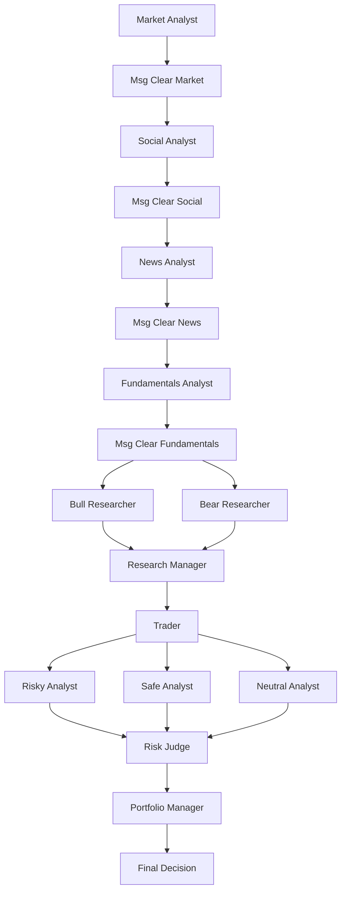

# Deep Thinking Trader — Architecture & Implementation Overview

This document explains the **architecture, logic, and implementation details** of the Deep Thinking Trader project. It focuses on how the modules work together, why they are structured this way, and how the system processes information end-to-end.

----------

## Project Purpose

The project builds a modular trading research pipeline where:

-   Specialized analysts gather diverse signals 📊.
    
-   Bull and Bear agents engage in adversarial debate.
    
-   A Research Manager synthesizes findings into a balanced investment strategy.
    
-   A Trader converts this into an actionable proposal.
    
-   A Risk team stress-tests it from multiple perspectives ⚖️.
    
-   A Portfolio Manager issues a binding **BUY/SELL/HOLD** decision.
    
-   The system stores lessons in long-term memory for improvement over time.
    

----------

## High-Level Agentic Architecture



----------

## Core Modules and Responsibilities

-   **`main.py`**  
    Orchestrates a workflow run and invokes the compiled LangGraph app.
    
-   **`workflow/build_workflow.py`**  
    Builds and compiles the LangGraph `StateGraph`. Defines nodes, edges, debate loops, and compiles into a runnable `app`.
    
-   **`workflow/state.py`**  
    Defines the state schema and merge rules. Keys include `ticker`, analyst reports, debate states, investment plan, trader plan, risk state, and final decision.
    
-   **`workflow/conditional_logic.py`**  
    Encodes decision rules for debate continuation and loop termination.
    
-   **`agents/`**
    
    -   `analyst_factory.py` — Market, Social, News, and Fundamentals analysts.
        
    -   `researcher_factory.py` — Bull/Bear debate agents with long-term memory.
        
    -   `research_manager.py` — Synthesizes debate and analyst reports into an `investment_plan`.
        
    -   `trader.py` — Converts investment plan into `trader_investment_plan`.
        
    -   `risk_factory.py` — Risky, Safe, Neutral analysts append to `risk_debate_state`.
        
    -   `portfolio_manager.py` — Makes the final decision.
        
    -   `auditor.py` — Extracts deterministic BUY/SELL/HOLD signal.
        
-   **`tools/toolkit.py`**  
    Provides APIs for analysts: stock data, news, sentiment, fundamentals.
    
-   **`memory/longterm_memory.py`**  
    Implements agent memory backed by Chroma. Stores and retrieves past experiences.
    
-   **`llm_provider/gemini_adapter.py`**  
    Wraps the Google Gemini SDK for chat and embeddings.
    
-   **`tests/`**  
    Unit and functional tests for each component, plus orchestration checks.
    
-   **LangSmith Integration**  
    Each node is wrapped with `@traceable`. This logs runs to LangSmith, where nested traces capture: Analyst → Debate → Manager → Trader → Risk → Portfolio.
    
    -   Allows detailed debugging 🔍.
        
    -   Enables evaluation against expected outcomes.
        

----------

## State Model and Merging Rules

Representative state keys:

```
{
  "ticker": "AAPL",
  "messages": [...],
  "market_report": str,
  "sentiment_report": str,
  "news_report": str,
  "fundamentals_report": str,
  "investment_debate_state": { "history": [...], "count": int },
  "investment_plan": str,
  "trader_investment_plan": str,
  "risk_debate_state": [...],
  "final_trade_decision": str
}

```

**Merge rules:**

-   `messages`: appended.
    
-   `ticker`: preserved across nodes.
    
-   Debate states: accumulate instead of overwrite.
    
-   Each node updates only its relevant keys.
    

----------

## Debate & Loop Orchestration

### Research Debate

-   Analysts feed into Bull and Bear researchers.
    
-   They alternate turns, appending to `investment_debate_state`.
    
-   Loop ends after a set number of rounds or conditional stop.
    
-   Research Manager synthesizes into a unified plan.
    

### Risk Debate

-   Trader plan is reviewed by Risky, Safe, and Neutral agents.
    
-   Each appends to `risk_debate_state`.
    
-   Portfolio Manager uses these to finalize the decision.
    

----------

## Memory (Chroma) Design

-   **AgentMemory** wraps a Chroma collection.
    
-   **add_memory(doc_id, text)** → embeds and stores text.
    
-   **get_memories(query, n_results)** → retrieves relevant past documents.
    
-   Results are formatted consistently for prompt integration.
    

----------

## Tests & Debugging

-   **Unit tests**: analysts, researchers, manager, trader, risk, portfolio.
    
-   **Sequence runner**: validates end-to-end execution without conditions.
    
-   **Debug graph**: simplified orchestration test.
    
-   **Visualization**: Mermaid diagrams to inspect workflow edges.
    
-   **Logging**: `[NODE START]`, `[NODE END]` with produced keys.
    

----------

## Observability & Failure Modes

-   Missing `ticker`: fixed with merge rules.
    
-   `InvalidUpdateError`: solved by accumulating lists.
    
-   Tool node parsing errors avoided by having analysts call `Toolkit` directly.
    
-   LangSmith traces + runtime logs give deep observability.
    

----------

## Evaluation & Extensions

-   **Evaluation**
    
    -   Unit-level checks (required tags present).
        
    -   System-level checks (final decision vs. expected).
        
    -   Metrics for latency, API usage, and memory retrieval quality.
        
-   **Extensions**
    
    -   Backtesting loop with memory feedback.
        
    -   Alternative vector DB backends.
        
    -   Broker integration for trade execution.
        
    -   Human-in-the-loop reviews.
        

----------

## Design Tradeoffs & Limitations

-   Multi-agent debates add robustness but increase latency.
    
-   LLM outputs require deterministic parsing for final signals.
    
-   Memory improves adaptability but adds complexity.
    
-   API usage cost depends on rounds and number of agents.
    
-   Logging to LangSmith introduces overhead but boosts debuggability.
    

----------

## Example Runtime Log

```
[NODE START] Market Analyst
[NODE END] Market Analyst -> produced keys: ['market_report']

[NODE START] Social Analyst
[NODE END] Social Analyst -> produced keys: ['sentiment_report']

[NODE START] Bull Researcher
[NODE START] Bear Researcher
...

[NODE START] Research Manager -> produced keys: ['investment_plan']

[NODE START] Trader -> produced keys: ['trader_investment_plan']

[NODE START] Risky Analyst
[NODE START] Safe Analyst
[NODE START] Neutral Analyst

[NODE START] Portfolio Manager -> produced keys: ['final_trade_decision']

```

----------

